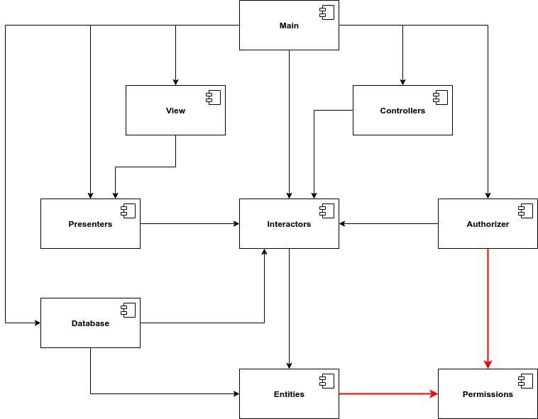

# Accoppiamento dei componenti

I prossimi tre principi riguardano le relazioni tra i componenti.

### Il principio ADP \(Acyclic Dependencies Principle\)

> Non consentite l'insorgere di cicli nel grafico delle dipendenze tra i componenti.

Considerate la struttura delle dipendenze dei componenti presenti in questa figura

Questa struttura è un **grafo diretto**. I componenti sono i **nodi** e le relazioni di dipendenza sono **archi diretti**. Notate un'altra cosa: indipendentemente dal componente da cui si parte è impossibile seguire le relazioni di dipendenza e ritornare nuovamente a tale componente. In pratica questra struttura non ha cicli. E' un grafo aciclico diretto \(DAG: Directed Acyclic Graph\). Se il team responsabile di _Presenters_ genera una nuova release, gli unici componenti influenzati da questa release saranno solo _View_ ****e _Main_. Se viene rilasciata una nuova release di _Main_, nessun componente sarà influenzato da questa nuova release.

### L'effetto di un ciclo nel grafico delle dipendenze tra i componenti

Supponiamo che dobbiamo modificare la classe _User_ di _Entities_ in modo tale che utilizzi la classe _Permissions_ di _Authorizer_. Questo crea un ciclo di dipendenze come mostrato nella seguente figura:

Questo ciclo di dipendenze complica molto l'isolamento dei componenti e genera problemi di compilazione, poiché rende difficile stabilire l'ordine in cui bisogna compilare i componenti.

### Spezzare il ciclo

Per risolvere questo problema dobbiamo spezzare il ciclo delle dipendenze. Per farlo possiamo adottare due meccanismi:

* **Applicare il principio DIP \(Dependency Inversion Principle\)**: possiamo creare all'interno di _Entities_ un'interfaccia _Permissions_ contenente i metodi richiesti da _User_. Questa interfaccia verrà poi implementata dalla classe di _Authorizer_. Questo inverte la dipendenza tra _Entities_ e _Authorizer_, spezzando quindi il ciclo.

* **Creare un nuovo componente**: possiamo creare un nuovo componente dal quale dipendono sia _Entities_ che _Authorizer._ In questo nuovo componente potranno essere spostate le classi da cui dipendono entrambi i componenti.

### Progettazione top-down

Da questa spiegazione possiamo concludere che la struttura a componenti non può essere progettata top-down. Non possiamo costruire un grafico delle dipendenze tra i componenti già all'inizio del progetto. I grafici delle dipendenze hanno poco a che fare con lo scopo dell'applicazione. Al contrario, essi rappresentano una mappa al riutilizzo e alla manutenzione dell'applicazione. Man mano che si scriveranno le interfacce e le classi, la struttura a componenti evolverà, così come le relazioni di dipendenza. Nelle fasi iniziali del progetto ci focalizzeremo maggiormente sui principi SRP e CCP, andando a collocare insieme quelle classi che hanno lo stesso motivo per dover cambiare. In questa maniera andiamo a isolare la volatilità dei componenti. I componenti che cambiano frequentemente non dovranno influenzare i componenti stabili. Per esempio non vogliamo che gli interventi della GUI influenzino la business logic. Mentre l'applicazione cresce iniziamo a preoccuparci del riutilizzo dei componenti. Così entra in gioco il principio CRP. Nel contempo dobbiamo monitorare le dipendenze tra i componenti per evitare l'insorgere di cicli di dipendenze \(principio ADP\). Se tentassimo di progettare questa struttura prima ancora che il progetto inizi, probabilmente non avremo successo.

### Il principio SDP \(Stable Dependencies Principle\)

> Puntate sulla stabilità.

Nella struttura di un'applicazione una certa volatilità è necessaria se la si vuole sottoporre a manutenzione. Alcuni componenti dell'applicazione vengono progettati proprio con lo scopo di essere volatili: ci aspettiamo che debbano cambiare. Altri componenti, invece, vengono progettati con lo scopo di essere stabili. Ma che cosa si intende per stabilità?

### Stabilità

Un componente è stabile quando è "difficile da modificare". Sono molti i fattori che rendono un compinente tale: per esempio le sue dimensioni, la sua complessità e la sua chiarezza. Il modo però più sicuro per rendere un componente difficile da modificare, è fare in modo che molti altri componenti dipendono da esso. Una qualsiasi modifica a quel componente potrebbe richiedere la modifica a tutti i componenti che da esso dipendono.

La seguente figura rappresenta X, il quale è un componente **stabile**. Sono tre i componenti che dipendono da X, pertanto X ha tre buoni motivi per non cambiare. Pertanto possiamo dire che X è **responsabile** di questi tre componenti. Al contrario, X non dipende da nulla, pertanto non ha alcuna influenza esterna che lo spinga a cambiare. Diciamo quindi che X è **indipendente**.

La seguente figura presenta Y, che è un componente **instabile**. Nessun componente dipende da Y, pertanto diciamo che esso è **non-responsabile**, ma dipende da tre componenti, quindi ha tre fonti esterne da cui potrebbero provenire i cambiamenti. Diciamo quindi che Y è **dipendente**.

### Metriche sulla stabilità

A questo punto possiamo calcolare la stabilità di un componente. Per farlo dobbiamo contare il numero di dipendenze che entrano ed escono da tale componente:

* **Fan-in / Fi \(dipendenze in ingresso\)**: identifica il numero di classi esterne a questo componente che dipendono dalle classi contenute nel componente.
* **Fan-out / Fo \(dipendenze in uscita\)**: identifica il numero di classi all'interno del componente che dipendono da classi situate all'esterno del componente.

$$
I = Fo / (Fi + Fo)
$$

Questa metrica è compresa nell'intervallo \[0, 1\]. _I_ = 0 indica un componente massimamente stabile. _I_ = 1 indica un componente massimamente instabile.

Immaginiamo di voler calcolare la stabilità del componente CC. Vi sono tre classi esterne a CC \(q, r e s\) che dipendono dalle classi situate in CC \(_Fan-in_ = 3\). Inoltre, vi è una classe di CC \(u\) che dipende da una classe situata all'esterno di CC \(_Fan-out_ = 1\). Di conseguenza `I = 1 / 4`. Ci troviamo di fronte a un componente abbastanza stabile. Il principio SDP dice che la metrica `I` di un componente dovrebbe essere maggiore delle metriche `I` dei componenti da cui esso dipende. In pratica, le metriche `I` dovrebbero decrescere nella direzione della dipendenza.

### Non tutti i componenti dovrebbero essere stabili

All'interno di un'applicazione è normale che ci siano alcuni componenti stabili e altri instabili. Questo rende l'applicazione modificabile.

La figura sopra mostra la configurazione ideale per un sistema a tre componenti. Immaginiamo di aggiungere un quarto componente \(_Flexible_\) e di far dipendere _Stable_ da questo componente.

_Flexible_ è un componente che è stato progettato per essere facile da modificare. Vogliamo che sia instabile. Tuttavia questa dipendenza che ha _Stable_ nei confronti di _Flexible_, rende quest'ultimo massimamente stabile e difficile da modificare. La dipendenza nasce dal fatto che la classe _u_ di _Stable_ utilizza la classe _c_ di _Flexible._

Per correggere questo problema dobbiamo spezzare la dipendenza. Per farlo possiamo applicare il principio DIP. Creiamo un'interfaccia _us_ e la inseriamo nel componente _Stable._ Questa interfaccia dichiara tutti i metodi che servono a _u_, __poi facciamo implementare questa interfaccia a _c._ Questo spezza la dipendenza tra i due componenti e ristabilisce la stabilità desiderata.

### Il principio SAP \(Stable Abstractions Principle\)

> Un componente dovrebbe essere tanto astratto quanto è stabile.

Le politiche di alto livello rappresentano ciò su cui si fonda la nostra applicazione. Esse dovrebbero stare all'interno di componenti tanto stabili quanto flessibili. Ma come fa un componente ad essere massimamente stabile e sufficientemente flessibile da accettare dei cambiamenti? La risposta sta nel principio OCP, il quale dice che le classi dovrebbero essere aperte alle estensioni, ma chiuse alle modifiche. Le classi conformi a questo principio sono le **classi astratte**.

### Introduzione al principio SAP

Questo principio stabilisce una relazione tra stabilità e astrattezza. Da un lato dice che un componente stabile deve essere anche astratto, così da renderlo flessibile alle modifiche. Dall'altro dice che un componente instabile dovrebbe essere concreto, così da rendere il suo codice facile da modificare. Pertanto, un componente stabile, dovrà consistere di classi astratte e interfacce, in modo tale da poter essere esteso. I principi SAP e SDP, insieme, sono analoghi al principio DIP per i componenti. Applicando i due principi insieme, possiamo dire che: **le dipendenze dei componenti dovrebbero essere rivolte nella direzione dell'astrazione.**

### **Misurare l'astrazione**

Per misurare l'astrattezza di un componente dobbiamo calcolare il rapporto tra il numero di classi astratte e interfacce presenti nel componente e il numero totale di classi presenti nel componente:

* **Nc**: numero di classi presenti nel componente
* **Na**: numero di classi astratte e interfacce presenti nel componente

$$
A = Na / Nc
$$

La metrica _A_ è compresa nell'intervallo \[0, 1\]. Il valore 0 significa che il componente non ha nessuna classe astratta. Il valore 1 significa che il componente ha solo classi astratte.

### La sequenza principale

A questo punto possiamo definire la relazione tra stabilità \(I\) e astrattezza \(A\)

In alto a sinistra, in \(0, 1\), troviamo i componenti massimamente stabili e astratti. In basso a destra, in \(1, 0\), troviamo i componenti massimamente instabili e concreti. Chiaramente non è possibile avere solo componenti appartenenti a questi due punti. Possiamo allora inferire quelle **zone di esclusione** in cui i componenti non dovrebbero trovarsi.

### Zona di dolore

In questa zona troviamo i componenti massimamente stabili e concreti. Questi componenti sono rigidi. Non possono essere estesi perché non sono astratti e sono difficili da modificare a causa della loro stabilità. Tuttavia ci sono dei componenti che potrebbero stare all'interno di questa zona. Stiamo parlando di quei componenti stabili, concreti, ma **non volatili**. Un esempio può essere la libreria String di Java. Questa libreria, pur essendo massimamente stabile e concreta, non è volatile. Non verrà mai modificata. Pertanto può rimanere nella zona di dolore. I componenti che invece sono stabili, concreti e cambiano frequentemente diventano problematici se cadono nella zona di dolore.

### Zona di inutilità

In questa zona troviamo i componenti massimamente astratti, ma instabili. Questi componenti sono inutili, perché contengono solo classi astratte da cui nessuno dipende.

### Evitare le zone di esclusione

I componenti più volatili dovrebbero trovarsi il più lontano possibile dalle zone di esclusione. La linea che connette \(1, 0\) e \(0, 1\) viene chiamata **sequenza principale**. E' in prossimità di questa linea che dovrebbero trovarsi quei componenti che non possono trovarsi nei punti \(1, 0\) e \(0, 1\).

### Distanza dalla sequenza principale

Arrivati a questo punto possiamo calcolare la distanza che c'è tra un componente e la sequenza principale:

$$
D = | A + I - 1 |
$$

L'intervallo di questa metrica è \[0, 1\]. Un valore pari a 0 indica che il componente è direttamente sulla sequenza principale. Un valore pari a 1 indica che il componente è il più lontano possibile dalla sequenza principale. Possiamo calcolare questo valore per ogni componente dell'applicazione, così da capire quali componenti devono essere riesaminati. Possiamo calcolare anche la media e la varianza delle metriche D per tutti i componenti di un progetto. Ci aspetteremmo di trovare una media e una varianza prossime allo zero. Grazie alla varianza possiamo capire quali componenti si discostano di più dalla sequenza principale rispetto agli altri.

