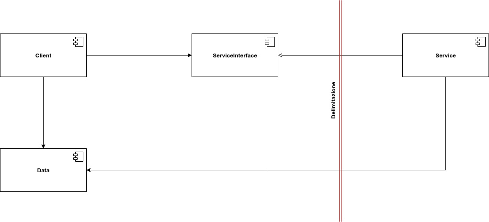

# Anatomia di una delimitazione

Le delimitazioni possono assumere varie forme. In questo capitolo tratteremo alcune delle più comuni.

### Il tanto temuto monolito

La forma più semplice delle delimitazioni è rappresentata dall'architettura monolitica, dove si ha un unico file eseguibile \(.jar, .exe e così via\) contenente un insieme di file. Pertanto, in questa architettura, il disaccoppiamento dei componenti non è fisico, ma solo a livello di codice sorgente. L'attraversamento delle delimitazioni avviene prevalentemente tramite una semplice chiamata a funzione. Questo assicura una comunicazione tra i vari componenti molto veloce ed economica.

### Componenti di deployment

Questa è la più semplice rappresentazione fisica di una delimitazione. Consiste in un insieme di librerie raccolte all'interno di un file .war o anche in una semplice directory. In questa modalità il disaccoppiamento avviene solo a livello di deployment. A parte quest'unica eccezione, i componenti si comportano come nell'architettura monolitica. Essi continuano a comunicare tra di loro attraverso semplici chiamate a funzione.

### Processi locali

Una delimitazione fisica ancora più forte è rappresentata dal processo locale. I processi locali operano nello stesso processore o nello stesso set di processori, ma in spazi di indirizzamento distinti. La comunicazione tra processi locali avviene tramite socket o code di messaggi. La strategia di segregazione tra processi locali è la stessa dei monoliti e dei componenti di deployment. Pertanto, il codice sorgente dei processi di alto livello non deve contenere riferimenti al codice dei processi di basso livello. Quest'ultimi devono fungere da semplici plugin.

### Servizi

La delimitazione più forte a livello fisico è rappresentata dal servizio. I servizi, infatti, non dipendono dalla loro posizione fisica. Possiamo avere servizi dislocati anche in macchine differenti. La comunicazione tra servizi avviene tramite lo scambio di pacchetti di rete. Questo significa che le comunicazioni sono più lente rispetto le semplici chiamate a funzione. Per il resto valgono le stesse regole di disaccoppiamento viste precedentemente. Il codice sorgente dei servizi di alto livello non deve contenere alcun riferimento \(nemmeno un url\) di un servizio di basso livello.

