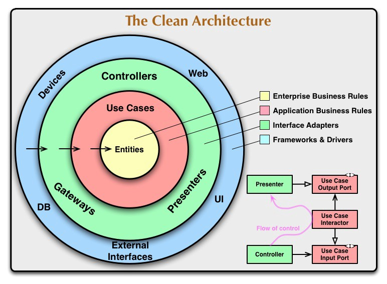

# Architettura clean

Nel corso degli ultimi decenni sono emerse varie idee sull'architettura dei sistemi. Sebbene queste idee possono variare nei dettagli, tutte hanno un obiettivo in comune: la suddivisione del software in livelli. Una buona architettura dovrebbe avere le seguenti caratteristiche:

* **Indipendenza dai framework**: le regole operative dell'applicazione non devono dipendere dal framework utilizzato.
* **Collaudabilità**: le regole operative devono poter essere facilmente collaudabili.
* **Indipendenza dalla UI**: l'interfaccia utente deve poter cambiare facilmente, senza costringere a modificare il resto del sistema.
* **Indipendenza dal database**: le regole operative non devono essere legate a nessuna tipologia di database.
* **Indipendenza da qualsiasi agente esterno**: le regole operative non devono sapere nulla dell'interfacciamento con le applicazioni esterne.

### La regola della dipendenza

La figura seguente mostra un esempio di "A_rchitettura Clean_":

I cerchi più interni rappresentano gli elementi di alto livello del software, mentre quelli più esterni rappresentano gli elementi di basso livello del software. La regola base su cui si basa questa architettura è la **regola della dipendenza**:

> Le dipendenze presenti nel codice sorgente devono puntare solo all'interno, verso le politiche di alto livello.

In sintesi, nulla in un cerchio interno può conoscere qualcosa di un cerchio più esterno. Pertanto, i dati dichiarati in un cerchio esterno non dovrebbero essere usati da un cerchio interno.

### Entità

Le entità incapsulano le regole operative critiche dell'azienda. Sono gli elementi meno soggetti a cambiamenti qualora dovesse cambiare qualcosa all'esterno. Questi oggetti, infatti, non dovrebbero essere influenzati dai cambiamenti riguardanti la UI, il database o qualsiasi altro agente esterno.

### Casi d'uso

Gli oggetti di questo livello contengono le regole operative specifiche dell'applicazione. Essi interaggiscono con le entità inviando dei dati e utilizzano i metodi presenti nelle entità per soddisfare gli obiettivi del caso d'uso. I cambiamenti che avvengono a questo livello non devono influenzare le entità, così come le modifiche alla UI, database o al framework non devono influenzare i casi d'uso.

### Adattatori di interfacciamento

Gli adattatori di interfacciamento, come le viste, i presenter, i controller e così via, sono degli oggetti che si occupano di convertire i dati dal formato più appropriato per i casi d'uso e le entità, al formato più appropriato per i servizi esterni, come il database o il Web. I modelli utilizzati per questo scambio di informazioni sono semplici strutture dati \(_Data Transfer Object_\).

### Framework e driver

Il livello più esterno è costituito da tutti i dettagli, come il framework, il database o il server web. Manteniamo tutti questi elementi all'esterno, dove possono fare solo pochi danni qualora dovessero cambiare.

### Attraversamento delle delimitazioni

Per attraversare le delimitazioni dei cerchi, senza violare la regola della dipendenza, dobbiamo fare affidamento al principio DIP. Utilizzeremo le interfacce e il polimorfismo dinamico in modo che le dipendenze presenti nel codice sorgente si oppongano al flusso di controllo nei punti di attraversamento delle delimitazioni.

Per esempio, immaginate che il caso d'uso deve richiamare il presenter. Questa chiamata non può essere diretta, perché altrimenti andremmo a violare la regola della dipendenza. Pertanto facciamo in modo che il caso d'uso utilizzi un'interfaccia e che tale interfaccia venga implementata nel presenter. Questa tecnica dovrebbe essere applicata per attraversare tutte le delimitazioni presenti nell'architettura.

### Quali dati attraversano le delimitazioni

I dati che attraversano le delimitazioni sono semplici strutture. Potete impiegare anche dei DTO \(_Data Transfer Object_\). L'importante è che siano semplici strutture e non oggetti complessi appartenenti ad altri cerchi. Per esempio, alcuni framework per database restituiscono i dati in un formato "grezzo". Non dobbiamo passare questa struttura grezza all'interno. Se lo facessimo violeremmo la regola della dipendenza, perché un cerchio interno finirebbe per conoscere qualcosa che attiene a un cerchio esterno. Pertanto, quando passiamo i dati attraverso una delimitazione, essi devono essere sempre nella forma più appropriata per il cerchio interno.

