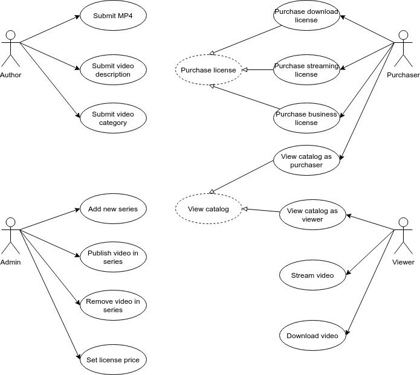
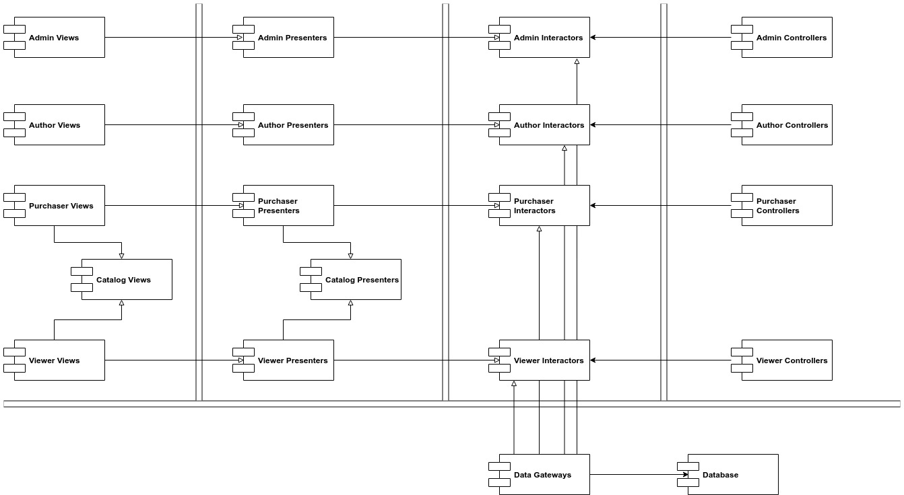

# Caso di studio: vendita di video

Applichiamo le regole finora viste in questo libro attraverso un semplice caso di studio.

### Il prodotto

Immaginiamo di dover sviluppare un'applicazione per la vendita di video corsi online a persone e aziende. Le persone possono pagare un prezzo per vedere i video in streaming e un altro, più elevato, per scaricare i video e tenerseli per sempre. Le licenze per le persone prevedono o il download dei video o lo streaming. Vi è un altro tipo di licenza, rivolta alle aziende, che consente loro di acquistare i video ad un basso costo e di consentirne la visualizzazione al proprio personale. Gli autori di video devono fornire i file del video e una serie di informazioni \(descrizione, categoria, esercizi ecc.\). Gli amministratori della piattaforma devono poter aggiungere delle serie di video, rimuovere/aggiungere video da una serie e impostare il prezzo per le licenze.

### Analisi dei casi d'uso

La figura seguente mostra un'analisi dei casi d'uso:

Sono presenti quattro attori principali \(Author, Admin, Purchaser e Viewer\). Secondo il principio SRP, questi quattro attori saranno le quattro principali fonti di modifiche al sistema. Pertanto vogliamo suddividere il sistema affinché una modifica per un attore non influenzi gli altri attori. I casi d'uso tratteggiati rappresentano i casi d'uso astratti. Un caso d'uso è astratto se definisce una politica generale che verrà implementata da un altro caso d'uso. I casi d'uso _View catalog as Purchaser_ e _View catalog as Viewer_ ereditano entrambi dal caso d'uso astratto _View catalog_.

### Architettura a componenti

Una volta definiti gli attori e i casi d'uso possiamo iniziare a definire l'architettura del sistema:

Le linee doppie rappresentano le delimitazioni dell'architettura. Potete vedere la suddivisione tipica fra View, Presenter, Interactor e Controller. Ognuna di esse è stata poi divisa in base agli attori corrispondenti. Ogni rettangolo rappresenta un componente che potrebbe essere inserito in un file .jar o .dll. I componenti _Catalog Views_  e _Catalog Presenters_ sono dei componenti astratti che contengono le classi che poi verranno ereditate dai componenti concreti _Purchaser Views/Viewer Views_ e _Purchaser Presenters/Viewer Presenters_. Una volta definiti i componenti possiamo combinarli seguendo un determinato tipo di architettura. Ad esempio, possiamo combinarli in cinque file .jar \(uno per le views, i presenters, gli interactors, i controllers e gli strumenti di servizio\). Oppure possiamo mettere nello stesso file .jar views e presenters, mentre per i restanti tre possiamo creare tre file .jar distinti. Oppure possiamo creare due file .jar: views e presenters nello stesso file .jar e tutto il resto nell'altro.

### Gestione delle dipendenze

Il flusso di controllo della figura precedente procede da destra a sinistra. I controllers catturano l'input dell'utente, lo passano agli interactors che elaborano i dati. Successivamente i presenters formattano questi dati per le views, le quali si occupano di stamparli a video. Tuttavia le frecce puntano nella direzione opposta rispetto al flusso di controllo. Ovvero nella direzione delle politiche di alto livello. Questo perché l'architettura segue la regola della dipendenza.

### Conclusioni

L'architettura precedente comprende due livelli di separazione. La prima è la separazione degli attori, in base al principio SRP; la seconda è la separazione dei livelli, in base alla regola della dipendenza. L'obiettivo è quello di separare i componenti che cambiano per motivi e momenti differenti. I motivi differenti corrispondono agli attori; i momenti differenti, invece, corrispondono ai livelli dell'applicazione.

