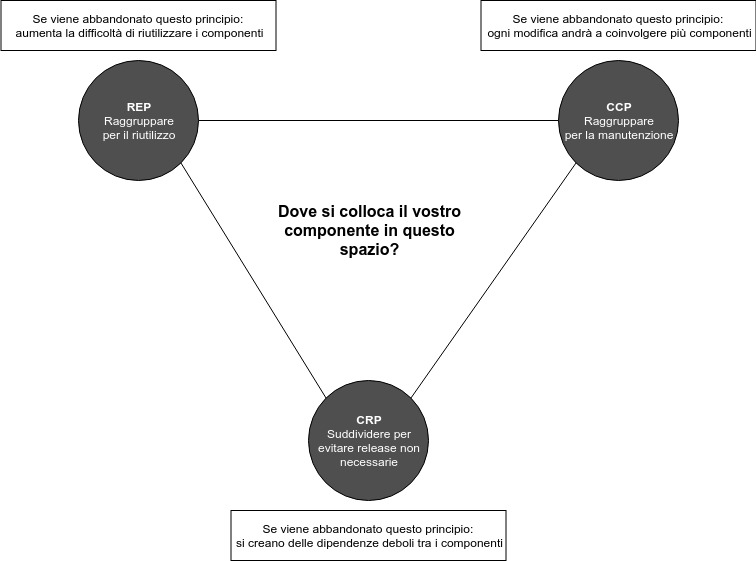

# Coesione dei componenti

Quando creiamo un componente, spesso ci domandiamo: "Quali classi e interfacce appartengono a questo componente?". Per rispondere a questa domanda dobbiamo andare a parlare dei tre principi di coesione dei componenti.

### Il principio REP \(Reuse/Release Equivalence Principle\)

Negli ultimi decenni sono stati creati una grandissima quantità di componenti e librerie riutilizzabili. Per chi utilizza questi componenti è fondamentale che essi siano sottoposti ad un processo di release. Questo non solo ci permette di capire se i componenti utilizzati sono ancora compatibili tra loro, ma ci aiuta anche a capire quali modifiche sono state apportate in quella determinata release, così da decidere se utilizzare la nuova o continuare con la vecchia release. Dal punto di vista dell'architettura, questo principio ci dice che le classi presenti all'interno di un componente devono appartenere ad un gruppo coeso. Il componente non può avere un ammasso di classi senza senso. Le classi presenti devono avere uno scopo comune, pertanto dovrebbero essere rilasciabili insieme.

### Il principio CCP \(Common Closure Principle\)

> Raccogliete nei componenti quelle classi che cambiano per gli stessi motivi e allo stesso tempo.

Il principio CCP è come il principio SRP, ma riformulato per i componenti. Questo principio, infatti, ci dice che un componente non dovrebbe avere più motivi per cambiare. Ciò significa che se dobbiamo effettuare una modifica, tale modifica è meglio che si verifichi in un solo componente, invece di essere distribuita su più componenti. In questa maniera i componenti che non dipendono dal componente modificato non hanno bisogno di essere modificati e deployati. Questo principio ci esorta a raccogliere nello stesso componente quelle classi strettamente connesse, fisicamente o concettualmente, e che hanno gli stessi motivi per dover cambiare.

### Il principio CRP \(Common Reuse Principle\)

> Non costringete gli utilizzatori di un componente a dipendere da cose delle quali non hanno bisogno.

Questo principio stabilisce che le classi che vengono utilizzate insieme appartengono allo stesso componente. Le classi appartenenti allo stesso componente devono essere strettamente connese, tanto da "collaborare" tra di loro per creare un'astrazione riutilizzabile. Quando un componente ne utilizza un altro, si crea una dipendenza tra i due componenti. Questa dipendenza si crea anche se viene usata una sola classe del componente usato. A causa di tale dipendenza, ogniqualvolta si effettua una modifica al componente usato, tutti i componenti che dipendono da esso devono essere ricompilati. Pertanto, quando creiamo un componente, dobbiamo assicurarci che le classi presenti siano inseparabili, tanto da dover dipendere da ogni classe di tale componente. Per questa ragione, questo principio viene anche definito come "la versione a componenti del principio ISP". Il principio CRP, infatti, ci esorta a non dipendere da componenti che contengono classi che non usiamo.

### Il diagramma di tensione per la coesione dei componenti

Se ci pensate, questi tre principi sulla coesione tendono a confliggere. I principi REP e CCP tendono a diminuire il numero di componenti, ma ad aumentarne la dimensione. Il principio CRP, invece, tende ad aumentare il numero dei componenti, ma a diminuirne la dimensione. Il tutto si può riassumere attraverso questo diagramma:

Se ci concentriamo troppo sui principi REP e CRP, ogniqualvolta effettueremo una modifica, quest'ultima andrà a coinvolgere un eccessivo numero di componenti, perché avremo tanti piccoli componenti. Se ci concentriamo troppo sui principi REP e CCP, ci troveremo ad avere una dipendenza debole tra i componenti. I migliori architetti devono saper dosare questi principi durante la fase di vita di un progetto. Inizialmente si tenderà a concentrarsi maggiormente sul lato destro del triangolo, dando maggiore importanza alla manutenibilità. Successivamente, invece, si tenderà a concentrarsi sul lato sinistro del triangolo, dando maggiore peso al riutilizzo dei componenti sviluppati.

