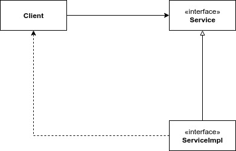
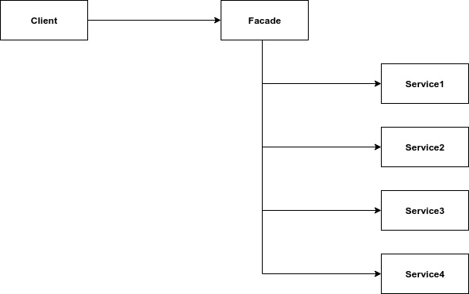

# Delimitazioni parziali

Le delimitazioni complete dell'architettura sono costose. Isolare completamente due componenti per renderli indipendenti richiede molto lavoro. Un buon architetto deve saper analizzare la situazione e decidere se implementare una delimitazione completa o parziale.

### Delimitazioni monodimensionali

Una delimitazione completa dell'architettura impiega delle interfacce di delimitazione reciproche per garantire l'isolamento dei componenti in entrambe le direzioni. Avere questo tipo di separazione in entrambe le direzioni è costoso in termini di lavoro. Una delimitazione parziale, in molte situazioni, è più che sufficiente.

L'interfaccia _Service_ viene usata da _Client_ e implementata da _ServiceImpl_. L'inversione della dipendenza è presente per separare _Client_ da _ServiceImpl_. Tuttavia, nulla impedisce a _ServiceImpl_ di utilizzare _Client_ \(come mostrato dalle linee tratteggiate\). Questa è una tipica **delimitazione monodimensionale**.

### Facade

Un altro esempio di delimitazione parziale è rappresentato dall'utilizzo del pattern **Facade**.

In questo esempio anche l'inversione della dipendenza viene sacrificata. La delimitazione è definita semplicemente dalla classe _Facade_, la quale fornisce dei metodi per richiamare dei servizi ai quali il client non deve poter accedere direttamente.

### Conclusioni

Abbiamo visto solo alcuni esempi di come poter creare una delimitazione parziale. Sta all'architetto capire dove potrebbe collocarsi, un domani, una delimitazione dell'architettura e se implementare pazialmente o integralmente tale delimitazione.

