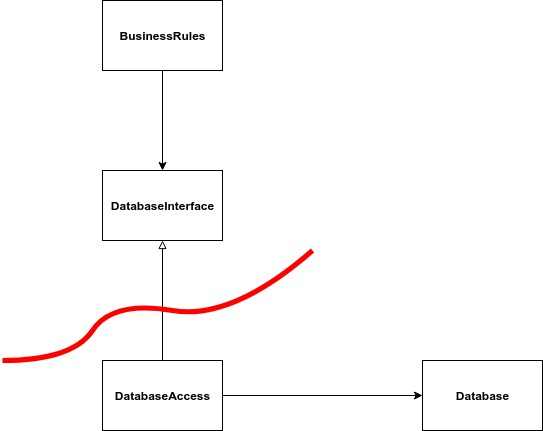
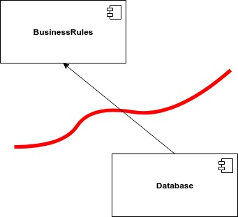

# Delimitazioni: tracciare una linea

L'architettura del software consiste nel tracciare delle linee, che chiamiamo **delimitazioni**, per separare i componenti l'uno dall'altro. Alcune di queste linee possono essere tracciate molto più tardi, poiché riguardano decisioni secondarie e differibili. Tra queste troviamo: il framework, il database, il server web e via discorrendo.

### Quali linee tracciare e quando tracciarle?

Occorre tracciare delle linee tra le cose che contano e quelle che non contano. Alle regole operative non interessa il database, pertanto ci dovrebbe essere una linea di separazione. Alle regole operative interessa soltanto sapere che esistono delle funzioni, nascoste dietro interfaccia, che servono per leggere e salvare i dati. Poi se viene usato un database relazionale, oppure non relazionale o ancora dei semplici file, alle regole operative questo non gli deve interessare.

Le _BusinessRules_ usano l'interfaccia _DatabaseInterface_ per leggere e salvare i dati. La classe _DatabaseAccess_ implementa l'interfaccia _DatabaseInterface_ per leggere e scrivere i dati su un database. Le _BusinessRules_ sono completamente all'oscuro di come e dove vengono salvati i dati. Questo ci consente di definire la seguente **delimitazione** tra i due componenti:

Ciò ci permette di posticipare la decisione su quale tipo di database utilizzare e concentrarci maggiormente sulle regole operative.

### Architettura a plugin

Tutte queste decisioni differibili come il database, l'interfaccia utente \(GUI\), il framework e così via, ci consentono di avere un sistema scalabile e manutenibile. Dove le regole operative vengono mantenute separate e indipendenti dai componenti opzionali. Questa architettura viene definita **architettura a plugin**.

