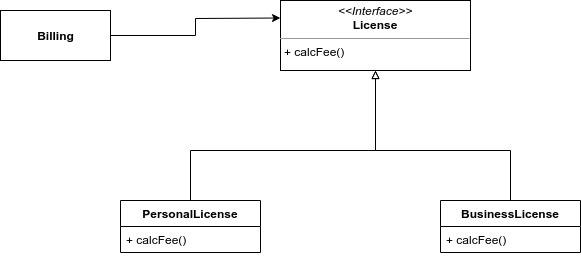
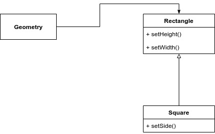

# Il principio LSP \(Liskov Substitution Principle\)

Questo principio afferma che:

> I tipi utilizzati all'interno di un programma dovrebbero essere sostituibili con i loro sottotipi senza alterare la correttezza del programma stesso.

### Un esempio di codice conforme al principio LSP

Immaginiamo di avere una classe `Billing` che utilizza un'interfaccia `License` con un metodo `calcFee`. Questa interfaccia viene implementata da due classi `PersonalLicense` e `BusinessLicense`:

Questo assetto non viola il principio LSP, poiché il comportamento di `Billing` non dipende da quale dei due sottotipi impiega.

### Un esempio di codice che viola il principio LSP

Immaginiamo di avere una classe `Geometry` che utilizza la classe `Rectangle`, la quale ha come sottotipo `Square`.

Questo assetto viola il principio LSP, poiché `Square` non può essere un sottotipo di `Rectangle` perché l'altezza e la larghezza di un `Rectangle` può variare in modo indipendente, mentre in uno `Square` no! Se adottassimo questo assetto saremmo costretti ad aggiungere un'istruzione `if` all'interno di `Geometry` per verificare il tipo di istanza passata.

