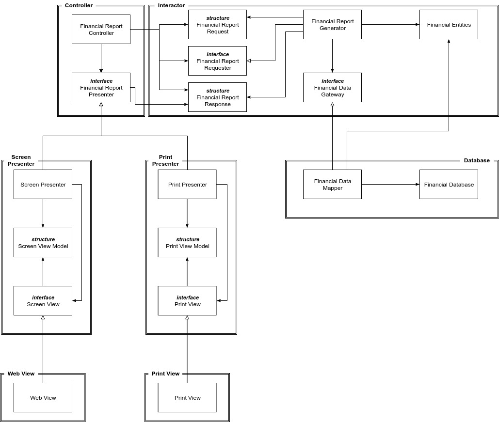

# Il principio OCP \(Open-Closed Principle\)

Questo principio è uno tra i più importanti e utilizzati nell'architettura di sistemi software. Il principio recita così:

> Un sistema software dovrebbe essere aperto alle estensioni e chiuso alle modifiche

In poche parole, un software, dovrebbe consentire l'estensione dei requisiti senza apportare importanti modifiche al codice scritto precedentemente. Se un semplice requisito aggiuntivo costringe ad effettuare stravolgimenti nella struttura software, vuol dire che c'è un grosso problema architetturale.

### Un esperimento

Immaginiamo di avere un sistema che si occupa di mostrare i dati finanziari in una pagina web. Dei committenti ci hanno chiesto di trasformare queste informazioni in un report da inviare ad una stampante. Se abbiamo applicato bene il principio SRP, ci troveremo dei componenti che si occupano di calcolare i dati finanziari e dei componenti che si occupano della presentazione dei dati. Avendo curato questa separazione tra gli **attori**, adesso dovremmo anche garantire che il comportamento possa essere esteso ****senza dover stravolgere il nostro sistema. Per farlo dovremmo separare i processi in classi e le classi in componenti:

Nella figura di cui sopra abbiamo in alto a sinistra il componente del **Controller.** In alto a destra **l'Interactor.** In basso a destra vi è il **Database.** Infine, in basso a sinistra vi sono quattro componenti: **Screen Presenter**, **Print Presenter**, **Web View** e **Print View**.

Le punte di freccia nere sono le relazioni di _uso_. Le punte di freccia bianche sono le relazioni di _implementazione_ o _ereditarietà_. Una freccia che punta dalla classe A alla classe B significa che il codice sorgente della classe A menziona il nome della classe B, mentre la classe B non menziona nulla della classe A. Una freccia che punta dal componente A al componente B significa che il componente A deve essere protetto dalle modifiche effettuate al componente B, affinché ciò avvenga, il componente B deve dipendere dal componente A. Infatti, se ci fate caso, il componente **Interactor** si trova in una posizione centrale, proprio per proteggerlo dalle modifiche che avvengono ai componenti **Database, Controller, Presenter e View.** L'Interactor si trova in una posizione centrale perché contiene il codice di livello più alto, pertanto esso **NON** deve dipendere dagli altri componenti "periferici" che contengono il codice di livello più basso. Il Controller invece è periferico rispetto l'Interactor, ma centrale rispetto i Presenter e le View. Questa gerarchia di componenti rappresenta il modo in cui opera il principio OCP. I componenti di alto livello di questa gerarchia devono essere protetti dalle modifiche apportate dai componenti di livello inferiore.

### Controllo della direzione

Come avete potuto notare dal grafico, in prossimità dei componenti vi sono delle interfacce. Queste interfacce hanno un ruolo fondamentale, in quanto ci permettono di controllare la direzione delle dipendenze tra i componenti. Oggi l'interfaccia **Screen View** punta in direzione verso il componente **Web View**, domani potremmo avere la necessità che questa stessa interfaccia punti in direzione verso un nuovo componente, per esempio **Mobile View**. Grazie a questa interfaccia il codice scritto in precedenza non dovrà subire alcuna modifica, basterà farsì che **Mobile View** implementi l'interfaccia **Screen View** e successivamente cambiare la direzione delle dipendenze.

### Celare le informazioni

Un altro scopo delle interfacce è quello di celare le informazioni. Lo vediamo osservando l'interfaccia **FinancialReportRequester**, la quale è lì per evitare che il **Controller** conosca più informazioni **dell'Interactor** di quanto ne siano necessarie. Vedremo meglio questo concetto quando parleremo del principio ISP \(Interface Segregation Principle\).

