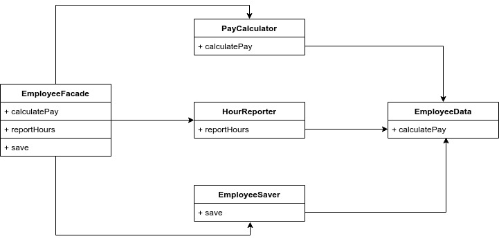

# Il principio SRP \(Single Responsibility Principle\)

Tra tutti i principi SOLID, questo è forse quello meno compreso. Spesso si tende a pensare che questo principio indichi che una classe "deve fare una cosa sola" nel significato stretto del termine. In realtà esiste già un principio così e si applica alle **funzioni**, ma ****quello, però, non è il principio SRP. I software vengono modificati per soddisfare gli utenti/committenti. Probabilmente vi saranno più utenti o committenti che vogliono la stessa modifica. Ebbene questo principio fa proprio riferimento alle modifiche richieste da un gruppo di utenti. Chiameremo questo gruppo un **attore**. 

Pertanto la versione reale del principio SRP è:

> Un modulo dovrebbe essere responsabile di uno e un solo attore

Per modulo intendiamo semplicemente un file di codice sorgente. Vediamo adesso un esempio di violazione di questo principio.

### Duplicazione accidentale

Immaginiamo di avere una classe `Employee` con tre metodi: `calculatePay`, `reportHours` e `save`

Questa classe viola il principio SRP perché questi tre metodi sono responsabili di tre attori differenti:

* Il metodo `calculatePay` trae le sue specifiche dal reparto contabilità
* Il metodo `reportHours` trae le sue specifiche dal reparto risorse umane
* Il metodo `save` trae le sue specifiche dagli amministratori del database

Questo accoppiamento tra questi tre attori può farsì che le modifiche richieste dal reparto contabilità influenzino qualcosa del reparto risorse umane. Per esempio, supponiamo che la funzione `calculatePay` e `reportHours` utilizzano \(attualmente\) lo stesso algoritmo presente nella funzione `regularHours`. Ora supponiamo che il team del reparto contabilità decida di modificare il modo in cui devono essere calcolate le ore per la paga, ma, il team del reparto risorse umane, non vuole questa modifica, perché intaccherebbe il calcolo della loro reportistica. Se accidentalmente venisse effettuata questa modifica al metodo `regularHours`, il team delle risorse umane si ritroverebbe dei report con dei dati errati. Questo è successo perché abbiamo messo in stretta relazione del codice che fa riferimento a tre attori differenti. **Il principio SRP esorta a separare il codice dal quale dipendono attori differenti.**

### **Soluzione**

Il modo migliore per risolvere questo problema è quello di separare le tre funzioni in classi differenti e utilizzare una struttura di soli dati chiamata `EmployeeData` per far condividere alle tre classi l'accesso alle informazioni riguardanti il dipendente. Il difetto di questa soluzione è che ora si hanno tre classi da istanziare e gestire. Una soluzione potrebbe essere quella di utilizzare il pattern [Facade](https://it.wikipedia.org/wiki/Fa%C3%A7ade_pattern).

`EmployeeFacade` è responsabile solo di istanziare e delegare le funzioni alle tre classi `PayCalculator`, `HourReporter` e `EmployeeSaver`. Un'altra soluzione potrebbe essere quella di mantenere i dati e il metodo più importante, ovvero `calculatePay`, all'interno della classe `Employee` e usare questa classe come "facciata" per le funzioni secondarie.

Potreste pensare che sia uno spreco avere delle classi che contengono una sola funzione. In realtà ognuna di queste classi avrà molti metodi privati ****con lo scopo di rendere il codice più facile da leggere.

