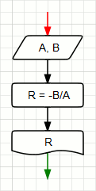
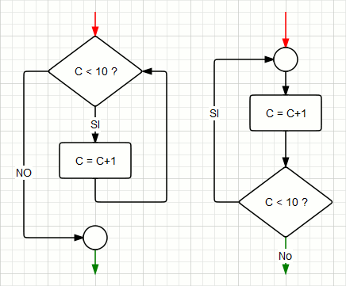

# La programmazione strutturata

Il paradigma della programmazione strutturata fu scoperto nel 1968 da Edsger Wybe Dijkstra. La sua scoperta partì nell'applicare ai programmi la disciplina matematica della dimostrazione. Egli si era reso conto che spesso gli usi del _goto_ rientravano nell'ambito di semplici strutture di controllo a selezione e iterazione, ovvero quei costrutti che tutti noi oggi identifichiamo come _if/else/then_ e _do/while_. Dijkstra dimostrò come queste strutture di controllo, combinate con l'esecuzione sequenziale, costituivano la base di tutti i programmi scritti. I programmi, alla fine, sono sempre stati costituiti da queste tre strutture: **sequenza**, **selezione** e **iterazione**.

#### Sequenza

#### Selezione

#### Iterazione

### La decomposizione funzionale

La programmazione strutturata rende possibile la decomposizione dei moduli in unità singolarmente dimostrabili. In pratica, un problema di larga scala può essere decomposto in varie funzioni di alto livello, le quali a loro volta possono essere decomposte in funzioni di basso livello e così via. Ciascuna funzione impiega le strutture di controllo di cui sopra.

### I test

La programmazione strutturata ci costringe a decomporre il programma in piccole funzioni dimostrabili. Tuttavia, la programmazione, nonostante manipoli dei costrutti matematici, non può definirsi un'attività matematica, ma più una scienza. Di fatto non possiamo dimostrare con assoluta certezza che le nostre funzioni siano corrette, così come invece si fa con le dimostrazioni matematiche. Dijkstra disse: "I test dimostrano la presenza e non l'assenza di bug". I test ci aiutano a dimostrare l'erroneità di una funzione, non la sua correttezza. Se tali test falliscono nel tentativo di dimostrare l'erroneità, allora vuol dire che la funzione è **sufficientemente** corretta per i nostri scopi.

