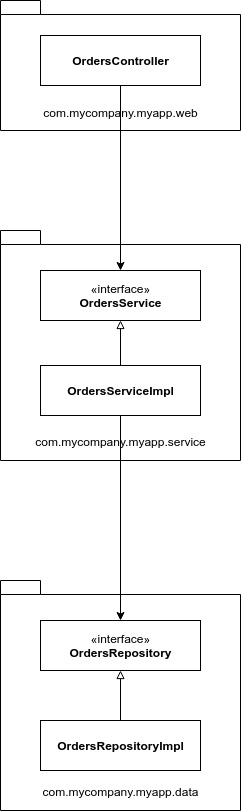
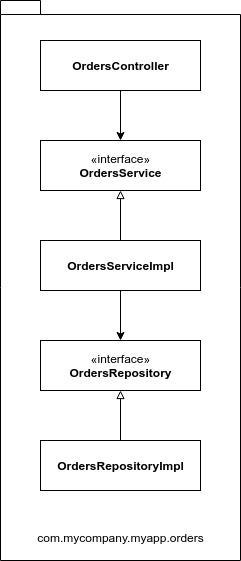
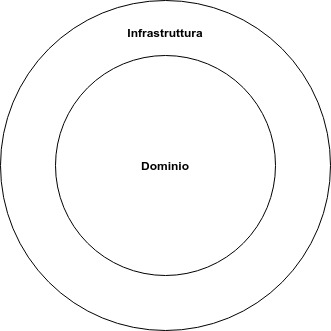
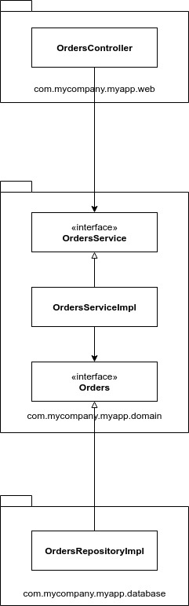
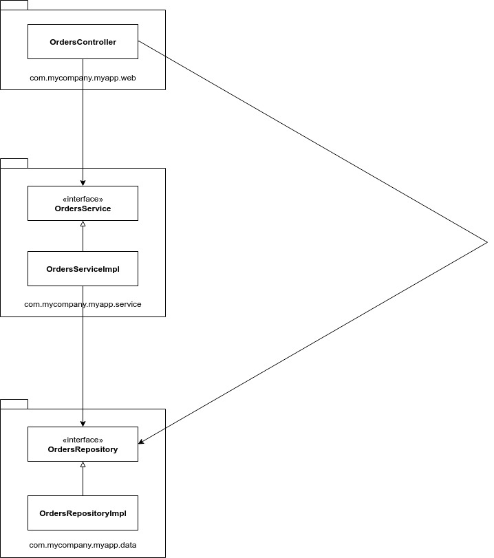
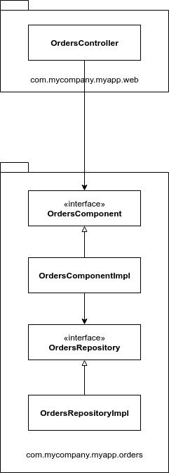
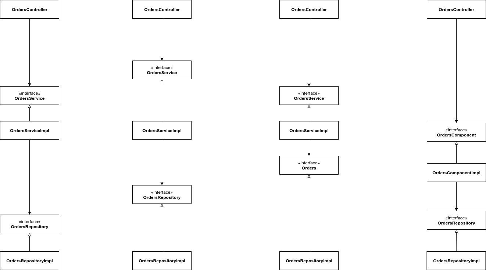
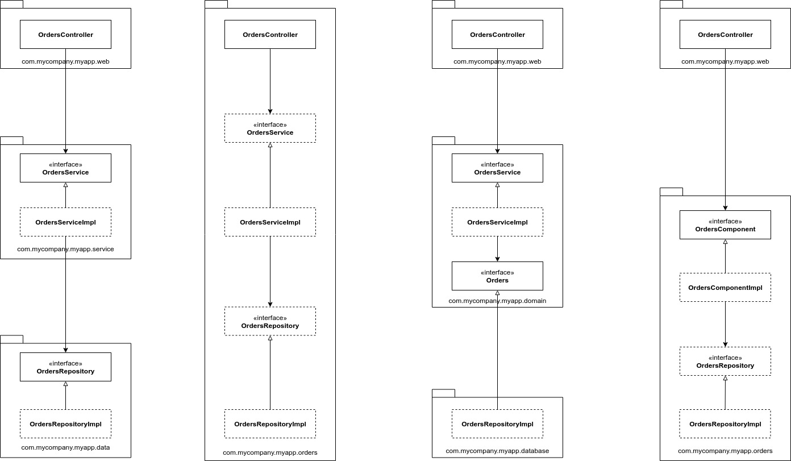

# Manca ancora qualcosa...

In questo ultimo capitolo andremo a vedere i diversi approcci alla progettazione e all'organizzazione del codice andando ad esaminare un caso di studio. Immaginiamo di dover realizzare un negozio che vende libri online e che uno dei casi di studio preveda il fatto che i clienti possano conoscere lo stato dei loro ordini.

### Suddivisione a livelli

Il primo approccio prevede un'architettura tradizionale a livelli orizzontali. In pratica suddividiamo il codice in base a quello che fa da un punto di vista tecnico con uno schema di **suddivisione a livelli**.

Abbiamo un livello per il codice web, un livello che conterrà la nostra logica operativa e un altro livello per la persistenza dei dati. In un'architettura a livelli rigida, i livelli dovrebbero dipendere solo dal livello adiacente sottostante. In Java, i livelli in genere sono implementati come package. Tuttavia, questo tipo di architettura presenta un problema, ovvero non "urla" nulla in termini di dominio operativo dell'applicazione. Se mettete a confronto due architetture a livelli, operanti in due domini operativi differenti, probabilmente si somiglieranno molto: web, servizi e repository.

### Suddivisione a funzionalità

Un altro modo per organizzare il codice consiste nell'adottare una **suddivisione a funzionalità**. Tutti i tipi vengono collocati in un unico package Java, in modo tale da formare un unico raggruppamento/concetto.

Come potete vedere le classi e le interfacce sono sempre le stesse, ma adesso sono raggruppate in un unico package \(**Orders\)**. In questa maniera è più semplice applicare le modifiche, perché il codice relativo agli ordini è tutto raggruppato in un unico posto. Inoltre adesso la nostra architettura "urla" qualcosa in termini di dominio.

### Porte e adattatori

Le architetture a **porte e adattatori** mirano a separare il codice rivolto al dominio operativo dell'applicazione dal codice relativo ai dettagli tecnici, come il framework e il database.

La regione interna contiene tutti i concetti del dominio, mentre la regione esterna contiene tutte le interazioni con il mondo esterno \(UI, database, integrazione di codice esterno...\). La regola principale è che: **il codice esterno dipende dal codice interno, mai il contrario**.

Il package _com.mycompany.myapp.domain_ qui è "l'interno", mentre gli altri due package sono "l'esterno". Notate come le dipendenze tra i package puntano tutte verso l'interno. Notate anche come _OrdersRepository_ adesso si chiama _Orders_. Questa scelta deriva dal mondo _domain-driven,_ il quale consiglia di denominare tutto ciò che si trova all'interno utilizzando termini del **linguaggio di dominio**.

### Suddivisione a livelli rilassata

Un altro motivo per cui le architetture a livelli dovrebbero essere considerate negativamente è dato dal fatto che esse potrebbero portare all'introduzione di dipendenze indesiderate. Abbiamo già detto che in un'architettura a livelli i package dovrebbero dipendere soltanto dal package adiacente sottostante. Ora immaginiamo che un nuovo caso d'uso deve essere sviluppato e che lo sviluppo venga affidato ad un nuovo collega. Quest'ultimo individua la classe _OrdersController_ e decide che questa deve essere il punto in cui aggiungere il nuovo codice. Tuttavia, egli ha bisogno di ottenere i dati degli ordini dal database. Così scopre l'interfaccia _OrdersRepository_ e decide di utilizzarla all'interno del controller. Questo fa sì che lo schema UML di prima assume il seguente aspetto:

Le frecce puntano ancora verso il basso, ma ora _OrdersController_ aggira l'interfaccia _OrdersService_ per alcuni casi d'uso. Questa organizzazione del codice viene definita **architettura a livelli rilassata**. In molti casi, aggirare la logica operativa, è indesiderabile, in particolare se la logica operativa si occupa dell'autorizzazione degli accessi ai singoli records.

### Suddivisione a componenti

L'obiettivo di una **suddivisione a componenti** è quello di raggruppare tutte le responsabilità legate a un unico componente a granularità "grossa" in un unico package. Questa organizzazione del codice è quella che viene adottata nelle architetture a micro-servizi.

Questo approccio unisce la logica operativa e il codice di persistenza dei dati in un unico package, che viene chiamato **componente**.

> Un componente rappresenta la più piccola unità di deployment. Un gruppo di funzionalità correlate, poste dietro un'interfaccia, collocate all'interno di un ambiente di esecuzione.

Un grande vantaggio di questo approccio è che se state scrivendo del codice che ha a che fare con gli ordini, vi è un unico posto da controllare: _OrdersComponent_. All'interno del componente la separazione degli ambiti viene mantenuta, pertanto la logica operativa è separata dal codice della persistenza dei dati.

### Organizzazione vs incapsulazione

Uno degli errori che spesso si commette è quello di utilizzare fin troppo spesso il modificatore d'accesso _public_. Se rendete _public_ tutti i tipi della vostra applicazione Java, i package diventano solo un meccanismo di organizzazione \(come le cartelle\) del codice e non uno strumento a servizio dell'incapsulazione. Il risultato è che a quel punto non conta più nulla quale stile scegliete per l'architettura. In pratica i quattro approcci all'architettura presentati diventano esattamente gli stessi:

Questo ci fa capire quant'è importante utilizzare in modo appropriato i modificatori d'accesso. Se riconsideriamo i package e nascondiamo i tipi per i quali il modificatore d'accesso può essere reso più restrittivo, la figura diviene così:

Procedendo da sinistra a destra, nell'approccio **suddivisione a livelli**, le interfacce _OrdersService_ e _OrdersRepository_ devono essere _public_ perché ci sono dei package esterni che dipendono da esse. Al contrario, le classi _OrdersServiceImpl_ e _OrdersRepositoryImpl_ possono essere protette, poiché nessuno ha la necessità di conoscerle. Nell'approccio **suddivisione a funzionalità**, l'_OrdersController_ rappresenta l'unico punto d'accesso al package, il resto può essere reso protetto. Nell'approccio a **porte e adattatori** solo le interfacce _OrdersService_ e _Orders_ devono essere rese public, perché ci sono dei package esterni che dipendono da esse. Infine, nell'approccio **suddivisione a componenti**, l'_OrdersComponent_ deve essere reso public, poiché rappresenta l'unico punto per accedere alle funzionalità del componente.

### Conclusioni

Abbiamo visto quattro approcci su come poter organizzare il codice di un'applicazione. In base al tipo di progetto che avete di fronte, pensate quale approccio può adattarsi meglio alle vostre esigenze. Tenete sempre in considerazione le dimensioni del vostro team, la sua preparazione e la complessità della soluzione in relazione con i vincoli di tempo e budget.

