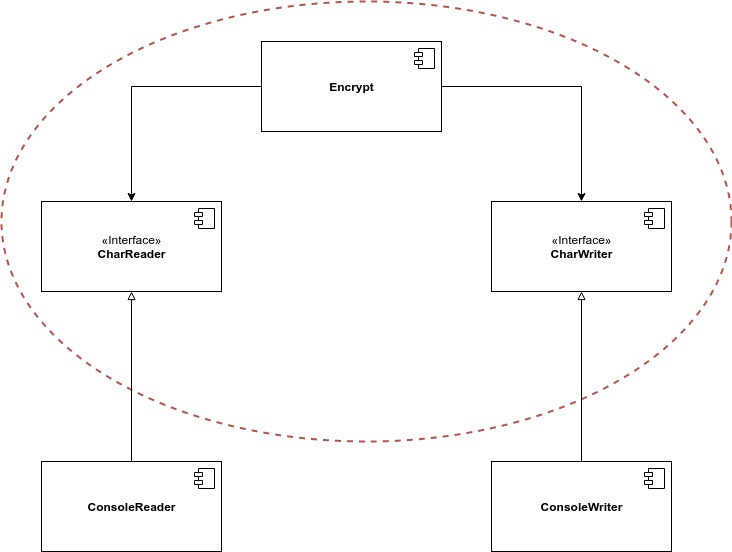

# Politiche e livelli

> Un programma è una descrizione dettagliata delle politiche attraverso le quali gli input vengono trasformati in output.

Sviluppare un'architettura software significa imparare a separare le politiche l'una dall'altra. Le politiche che cambiano per gli stessi motivi e contemporaneamente, si trovano allo stesso livello e, pertanto, dovrebbero appartenere allo stesso componente. Le politiche che cambiano per motivi o in momenti differenti, si trovano a livelli differenti e, pertanto, dovrebbero trovarsi in componenti separati.

### Livello

Se volessimo dare una definizione di livello potremmo dire che esso è **la distanza dagli input e dagli output**. Più lontana è una politica dagli input e dagli output del sistema, maggiore è il suo livello. Le politiche più vicine agli input e agli output sono quelle di livello più basso. Guardate lo schema seguente, il quale rappresenta un semplice programma di crittografia che legge dei caratteri da un device di input, li traduce e poi scrive i caratteri tradotti su un device di output:

Il componente _Translate_ è quello di livello più elevato, perché è più lontano dagli input e dagli output. Notate anche come le dipendenze, rappresentate dalle frecce tratteggiate, puntano in una direzione differente rispetto al flusso di controllo. Se volessimo rappresentare sotto forma di diagramma UML il grafico precedente, avremo qualcosa di questo tipo:

Il componente tratteggiato è composto dalla classe _Encrypt_ e dalle interfacce _CharReader_ e _CharWriter_. Le classi _ConsoleReader_ e _ConsoleWriter_ si trovano ad un livello inferiore, perché sono più vicine agli input e agli output. Questa suddivisione delle politiche ci consente di apportare modifiche ai device di input e output senza influenzare la politica di crittografia. Sarà molto più probabile che cambi il device di input/output rispetto all'algoritmo di crittografia. Le politiche di alto livello, infatti, tendono a cambiare meno frequentemente e per motivi più importanti rispetto alle politiche di basso livello.

### Conclusioni

Da questo semplice esempio abbiamo visto l'applicazione dei principi: SRP, OCP, CCP, DIP, SDP e SAP. Osservate bene l'esempio e cercate di identificare dove e perché è stato utilizzato ognuno di questi principi.

