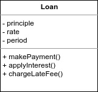

# Regole operative

Un sistema è suddiviso in regole operative e plugin. Ma che cosa sono le regole operative? In senso stretto, **le regole operative sono regole o procedure che permettono di creare o risparmiare denaro**. Esse esisterebbero a prescindere, anche se ad applicarle non ci fosse un computer. Per esempio, la banca che addebita una percentuale di interessi per un prestito è una regola operativa che permette alla banca di accumulare denaro. Questa regola esisterebbe a prescindere, non importa se a calcolare gli interessi sia un computer o un impiegato. Questo tipo di regole vengono definite **regole operative critiche**. Le regole operative critiche, solitamente, richiedono dei dati da elaborare. Nel nostro esempio, un prestito richiederebbe: una somma, un tasso di interesse e un piano di rimborso. Questi dati vengono definiti **dati operativi critici**. Le regole operative critiche e i dati operativi critici possono formare un oggetto, che chiameremo **entità**.

### Entità

Un'entità è un oggetto, il quale contiene i dati operativi critici \(o comunque ha accesso diretto ad essi\) e delle funzioni che implementano le regole operative critiche che operano su tali dati. L'entità seguente rappresenta un prestito:

Essa è ignara dei dettagli relativi al database, all'interfaccia utente e al framework utilizzato. Può svolgere i propri compiti in qualsiasi sistema, indipendentemente dai dettagli presenti nell'applicazione.

### Casi d'uso

Alcune regole operative permettono all'azienda di creare o risparmiare denaro definendo il modo in cui può operare un **sistema automatizzato**. Prendendo l'esempio precedente, immaginate che la banca decida che gli addetti ai prestiti, prima di stimare l'importo, devono raccogliere le informazioni sul cliente e assicurarsi che la solvibilità del richiedente sia maggiore di 500. Se non eseguono tutti questi passaggi non possono accedere alla schermata di prestito. Questo è un **caso d'uso**, ovvero una descrizione del modo in cui deve essere utilizzato un sistema. **Un caso d'uso specifica le regole operative dell'applicazione, non le regole operative critiche delle entità**. Notate questo esempio di caso d'uso:

Notate come nell'ultima riga si fa riferimento all'entità _Cliente_. I casi d'uso interagiscono con i dati e le funzioni contenute nelle entità. Le entità \(alto livello\) non sono a conoscenza dei casi d'uso \(basso livello\) che le controllano. I casi d'uso si trovano ad un livello inferiore rispetto alle entità perché sono specifici dell'applicazione e sono più vicini agli input e agli output del sistema. Le entità sono generalizzazioni che possono essere usate anche in altre applicazioni, pertanto sono più lontane dagli input e dagli output del sistema. Infine, i casi d'uso, così come le entità, devono essere indipendenti dal tipo di interfaccia utente e dal tipo di database utilizzato.

### Modelli a richiesta e risposta

La classe del caso d'uso accetta in input delle semplici strutture di dati di richiesta \(DTO\) e restituisce in output delle semplici strutture di dati di risposta. Queste strutture di dati **NON** devono dipendere da interfacce standard del framework, come _HttpRequest_ o _HttpResponse_. Se queste strutture di dati non fossero indipendenti, allora i casi d'uso si troverebbero legati all'interfaccia Web. Altra cosa da evitare è quella di far contenere a queste strutture dati i riferimenti alle entità. Gli scopi di questi due oggetti sono molto differenti. Nel corso del tempo essi cambieranno per motivi o in momenti molto differenti.

