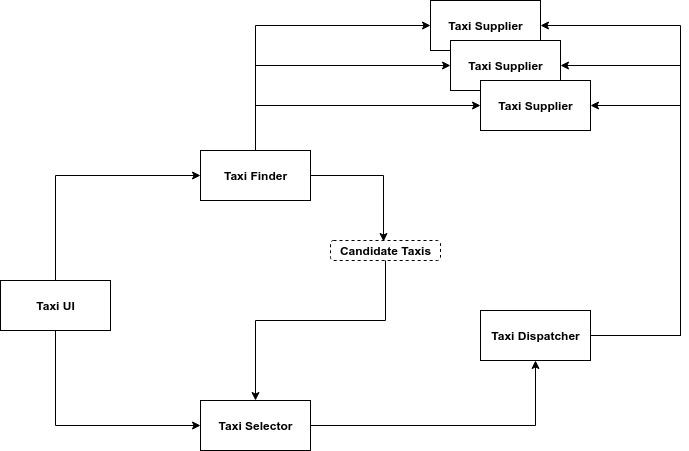
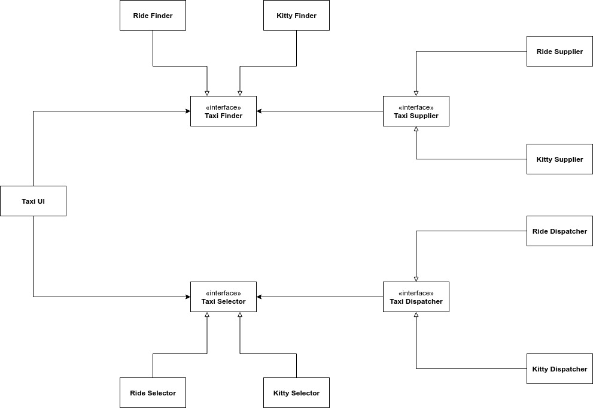

# Servizi: grandi e piccoli

Le architetture _service-oriented_ e a micro-servizio sono oggi molto popolari. Tuttavia, il fatto che il sistema sia diviso in servizi, non definisce di per sè un'architettura. Ciò che definisce un'architettura sono le delimitazioni che separano le politiche di alto livello dai dettagli di basso livello in base alla regola della dipendenza. Pertanto, quando parliamo di servizi, dobbiamo distinguere due categorie: quelli che sono significativi dal punto di vista dell'architettura, i quali definiscono delle delimitazioni, e quelli che semplicemente separano un comportamento da un altro. In questo capitolo ci occuperemo dei primi.

### L'illusione nel disaccoppiamento

Uno dei presunti benefici dell'architettura a servizi è che essi sono fortemente disaccoppiati fra loro. Questo è parzialmente vero. Essi, in realtà, sono accoppiati in termini di risorse e dati che condividono. Per esempio, se a un record che viene scambiato fra i servizi viene aggiunto un nuovo campo, dovrà essere adattato ogni servizio che opera sul nuovo campo. Pertanto tali servizi si trovano fortemente accoppiati al record e di conseguenza sono indirettamente accoppiati fra loro.

### L'illusione dello sviluppo e del deployment indipendenti

Un altro vantaggio attribuito ai servizi è che essi possono essere attribuiti a team indipendenti. Ogni team è responsabile dello sviluppo, della manutenzione e dell'operatività di un servizio. In questa maniera si ritiene che i servizi siano sviluppabili e distribuibili in modo indipendente. Questo è parzialmente vero. L'illusione del disaccoppiamento fa sì che i servizi non sempre possono essere sviluppati e distribuiti in maniera indipendente. Nel momento in cui hanno dei dati condivisi, lo sviluppo, il deployment e l'operatività devono essere coordinati.

### Il problema dei gattini

Immaginate di avere un sistema di prenotazione taxi. Questo sistema consente ai clienti di prenotare un taxi sulla base di un certo numero di criteri: tempo di arrivo, prezzo, lusso e così via. Usando un sistema a micro-servizi avremo qualcosa di questo tipo:

* **Taxi UI**: è il servizio che si occuppa dell'interfaccia grafica
* **Taxi Finder**: si occupa di esaminare la disponibilità dei _TaxiSupplier_
* **Taxi Selector**: prende i criteri dell'utente e sceglie un taxi fra quelli disponibili
* **Taxi Dispatcher**: si occupa di ordinare il taxi una volta scelto dal _TaxiSelector_

Un bel giorno a questo sistema deve essere aggiunta una funzionalità che consente ai clienti di ordinare e farsi consegnare un gattino a casa. Quando viene ordinato un gattino, il taxi in prossimità verrà incaricato di raccoglierlo in un determinato punto e consegnarlo all'indirizzo del cliente. Quanti servizi dovranno essere modificati per aggiungere questa funzionalità? Tutti! Queste funzionalità trasversali portano a modificare l'intero sistema, indipendentemente dal fatto che si tratta di un'architettura a micro-servizi o meno.

### Il soccorso degli oggetti

Utilizzando un'architettura a componenti e i principi SOLID possiamo risolvere il problema creando delle interfacce che ci consentono di gestire meglio le dipendenze.

In questa maniera riusciamo ad attraversare le delimitazioni e ad obbedire alla regola della dipendenza. Con questo nuovo schema, se dovesse essere aggiunta una nuova funzionalità, basterà aggiungere un nuovo componente e modificare solo la_TaxiUI_. Questo esempio ci fa capire che una buona architettura non è resa tale solo perché vengono utilizzati i micro-servizi, ma è come vengono gestite le delimitazioni a rendere buona un'architettura.

### Servizi a componenti

Lo schema di cui sopra possiamo adottarlo anche per un'architettura a servizi. I servizi non per forza devono essere dei piccoli monoliti. Essi possono impiegare anche una struttura a componenti. Un servizio \(in Java\) può contenere una serie di interfacce o classi astratte iniziali contenute in un file jar. Ogni nuova funzionalità sarà un altro file jar contenente le classi che implementano le interfacce contenute nel file jar iniziale. Ogni servizio, quindi, sarà formato da una serie di componenti, ognuno dei quali rappresenta un estensione delle funzionalità del componente iniziale di quel servizio.

